# Hack Smarter Labs Web Application Security Assessment

**Assessment date:** July 2026<br>
**Target:** `http://hacksmarter.hsm/` (`10.0.29.216`)<br>
**Environment:** Hack Smarter Labs course environment<br>
**Assessment type:** Authenticated and unauthenticated web application testing

## Disclaimer

This assessment was performed exclusively within the Hack Smarter Labs course environment. The target application is a deliberately vulnerable lab system. No real systems, networks, or data were accessed. All credentials used during testing were provided by the course instructor.

## Executive Summary

Testing identified multiple weaknesses affecting confidentiality, integrity, and account security. The most significant issues were an unrestricted administrative file upload that permitted server-side PHP execution, local file inclusion through the language selector, and broken object-level authorization in the profile-update function. Together, these flaws could permit an attacker with appropriate application access to execute code on the server, read local files, or modify another user's account information.

Additional findings included stored cross-site scripting, user enumeration, weak password requirements, an open redirect, publicly exposed diagnostic information, HTML injection, clickjacking exposure, and directory listing. The application should prioritize strict authorization checks, safe file handling, allowlist-based path selection, output encoding, and secure server configuration.

## Scope and Methodology

Testing covered the primary site and the discovered development virtual host:

- `http://hacksmarter.hsm/`
- `http://dev.hacksmarter.hsm/`
- `10.0.29.216`

The assessment used instructor-provided user and administrator accounts, plus test accounts created in the lab. Activities included application fingerprinting, content discovery, request manipulation, authentication testing, access-control testing, input validation testing, file-upload testing, and browser security-control review. Tests stopped after bounded proof of impact.

## Findings Summary

| ID | Finding | Severity | Status |
|---|---|---:|---|
| HSL-01 | Unrestricted administrative file upload permits PHP execution | Critical | Confirmed |
| HSL-02 | Local file inclusion through the `lang` parameter | High | Confirmed |
| HSL-03 | IDOR permits modification of another user's email address | High | Confirmed |
| HSL-04 | Stored cross-site scripting in forum replies | Medium | Confirmed |
| HSL-05 | Public `phpinfo()` page discloses internal configuration | Medium | Confirmed |
| HSL-06 | Login responses permit username enumeration | Low | Confirmed |
| HSL-07 | Registration accepts weak passwords | Low | Confirmed |
| HSL-08 | User-controlled post-login redirect | Low | Confirmed |
| HSL-09 | Stored HTML injection in forum content | Low | Confirmed |
| HSL-10 | Missing anti-framing protection permits clickjacking | Low | Confirmed on `cart.php` |
| HSL-11 | Directory listing exposes application structure | Informational | Confirmed |

Severity ratings reflect the demonstrated lab impact and may require adjustment to match a specific scoring policy.

## Detailed Findings

### HSL-01: Unrestricted Administrative File Upload Permits PHP Execution

**Severity:** Critical<br>
**Affected function:** Admin Panel → Global Settings → Update Site Logo

#### Description

The site-logo upload function performs insufficient server-side validation. A request could be modified so that a file with a PHP extension was accepted and stored beneath the web-accessible uploads directory. Requesting the uploaded file caused the server to process it as PHP rather than serve it only as static content.

#### Steps to Reproduce

1. Authenticate as an administrator and open the Global Settings page.
2. Select a file in the Update Site Logo control and intercept the submission.
3. Change the uploaded filename to use a `.php` extension and use an image content type.
4. Submit the request and note the application-reported upload location.
5. Request the uploaded file from the web-accessible upload directory.
6. Observe that PHP content is interpreted by the server.

#### Evidence

- The normal interface reports that a text file is not a valid image.
- After the intercepted upload was modified, the application returned a successful upload response.
- Direct access to the uploaded PHP file produced server-side execution output.

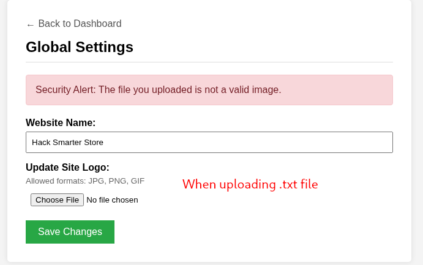

*Figure 1 — Normal client workflow rejects a non-image upload.*

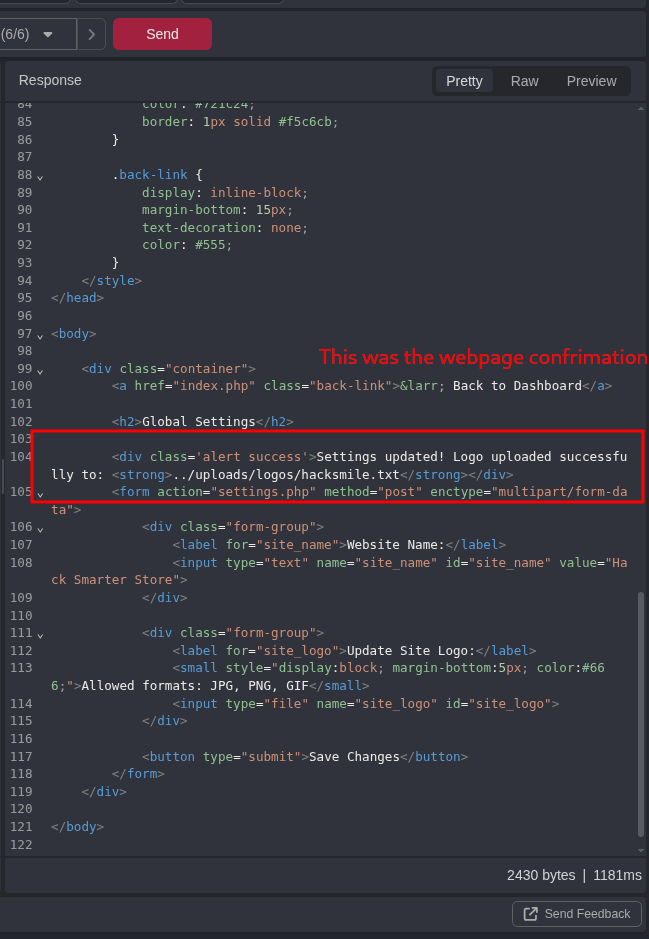

*Figure 2 — Cropped server response confirming the modified upload was accepted. Request credentials were omitted.*

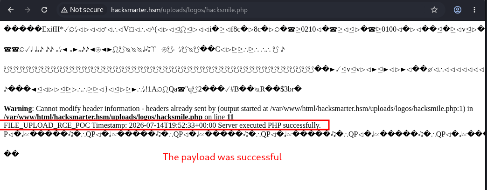

*Figure 3 — Web-accessible PHP upload produced server-side execution output.*

#### Impact

An authenticated administrator—or an attacker who obtains equivalent access—could execute arbitrary PHP in the web-server context. This may permit complete application compromise, access to application data and secrets, and further compromise of the lab container.

#### Remediation

- Store uploads outside the web root and serve them through a controlled download handler.
- Decode and validate image content with an image-processing library; do not trust the filename or `Content-Type` header.
- Generate server-side filenames and allow only approved extensions.
- Configure the upload directory so scripts cannot execute.
- Apply least privilege to the web-server account and remove obsolete uploaded files.

### HSL-02: Local File Inclusion Through the `lang` Parameter

**Severity:** High<br>
**Affected endpoint:** `GET /index.php?lang=...`

#### Description

The language selector passes user-controlled input into a server-side file-loading operation. Traversal sequences and encoded variants allowed files outside the intended language directory to be included. The response disclosed `/etc/passwd`, confirming access to local operating-system files readable by the web process.

#### Steps to Reproduce

1. Capture a normal request such as `GET /index.php?lang=en.php`.
2. Replace the language value with a traversal value targeting `/etc/passwd`.
3. Repeat with URL-encoded or double-encoded traversal sequences if normalization occurs.
4. Observe local account entries from `/etc/passwd` in the HTTP response.

#### Evidence

- The normal language selector supplied a filename through the `lang` parameter.
- A traversal payload returned local account records, as shown below.
- Multiple encoding variants produced the same local-file content during testing.

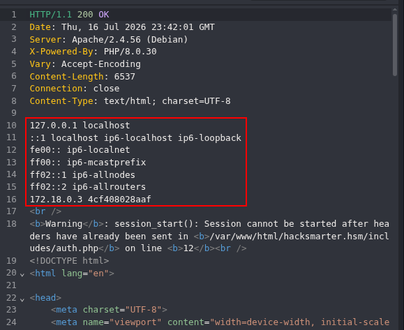

*Figure 4 — Cropped response containing `/etc/passwd` data. The request and session cookie were omitted.*

#### Impact

An attacker could read sensitive local files accessible to the web-server account. Depending on available files and PHP configuration, this could expose source code, credentials, keys, logs, or session material and could enable a subsequent compromise.

#### Remediation

- Map fixed language identifiers (for example, `en` and `es`) to hard-coded files.
- Reject path separators, dots, URL-encoded traversal sequences, wrappers, and unexpected values.
- Canonicalize paths and verify that the resolved path remains inside the approved language directory.
- Avoid passing request parameters directly to `include`, `require`, or file-reading functions.

### HSL-03: IDOR Permits Modification of Another User's Email Address

**Severity:** High<br>
**Affected endpoint:** `POST /update_profile.php`

#### Description

The profile update request contains a client-controlled numeric `id`. During testing, a regular user's authenticated request could be changed to reference another account, including the administrator account. The server applied the update to the supplied ID instead of deriving the target account from the authenticated session.

#### Steps to Reproduce

1. Authenticate as a normal user and submit a change to that user's email address.
2. Capture the `POST /update_profile.php` request.
3. Keep the valid session and CSRF token, but change the `id` parameter to another user's ID (the lab used `1`).
4. Set the `email` parameter to a controlled test address and submit the request.
5. Verify that the other account's email address changed.

#### Evidence

- The administrator account's original email address was documented before testing.
- A normal-user profile request was changed to target account ID `1`; the raw request is withheld because it contains session and CSRF material.

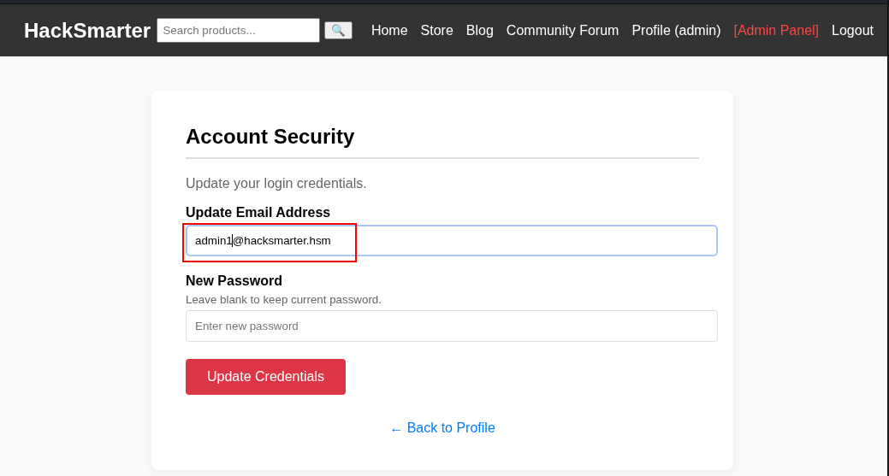

*Figure 5 — Administrator account state recorded before the IDOR test.*

#### Impact

A low-privileged authenticated user can modify another user's account data. Changing an administrator's email may facilitate account recovery abuse or administrative account takeover, depending on the password-reset implementation.

#### Remediation

- Derive the account ID from the authenticated server-side session for self-service profile changes.
- Enforce object-level authorization on every profile update.
- Reserve cross-account changes for an explicitly authorized administrative workflow.
- Require reauthentication and verification when changing security-sensitive account attributes.

#### Classification Note

The captured request contains a CSRF token, so the supplied evidence does not establish a missing-CSRF-token vulnerability. It does establish broken object-level authorization because changing the object ID modifies another account.

### HSL-04: Stored Cross-Site Scripting in Forum Replies

**Severity:** Medium<br>
**Affected function:** Community Forum replies

#### Description

Forum reply content is stored and rendered without sufficient output encoding or sanitization. An image element with an event handler was accepted. When a viewer interacted with the rendered element, JavaScript executed in the application origin.

#### Proof of Concept

```html

```

#### Steps to Reproduce

1. Authenticate and open a forum thread.
2. Submit the proof-of-concept value as a reply.
3. Reload the thread as a viewing user.
4. Click the broken-image element.
5. Observe the JavaScript alert in the `hacksmarter.hsm` origin.

#### Evidence

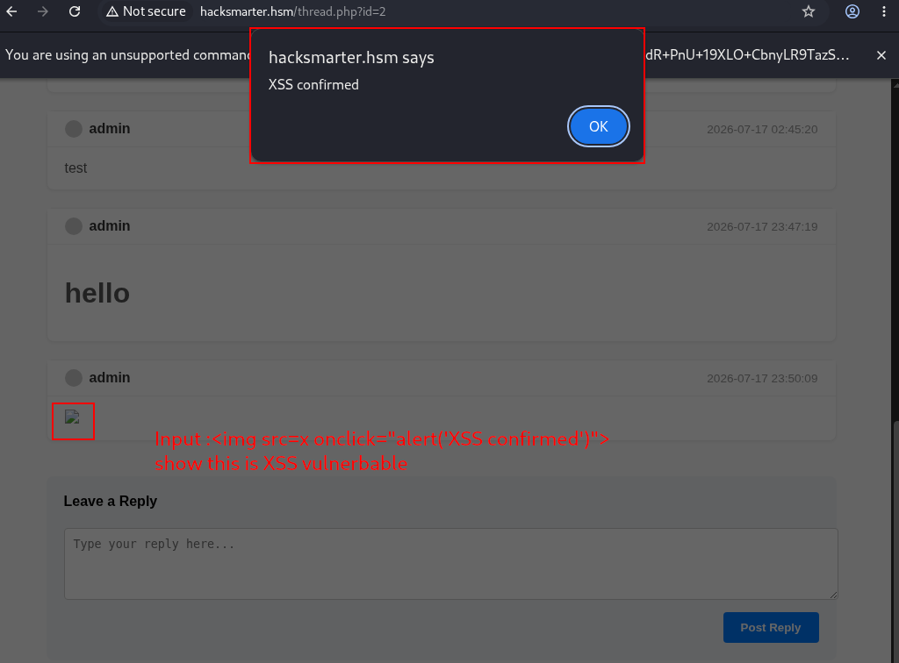

*Figure 6 — Stored forum reply executes JavaScript following user interaction.*

#### Impact

An attacker could execute JavaScript in another user's browser after interaction with the stored content. Depending on cookie protections and available application functions, this could enable actions as the victim, interface manipulation, or disclosure of browser-accessible data.

#### Remediation

- Apply context-aware output encoding to all user-generated content.
- If limited markup is required, sanitize it with a maintained allowlist-based HTML sanitizer.
- Disallow event-handler attributes and unsafe URL schemes.
- Deploy a restrictive Content Security Policy as defense in depth.

### HSL-05: Public `phpinfo()` Page Discloses Internal Configuration

**Severity:** Medium<br>
**Affected endpoint:** `http://dev.hacksmarter.hsm/info.php`

#### Description

The development virtual host exposes a `phpinfo()` page without authentication. The page discloses internal infrastructure and security-relevant runtime configuration, including the container hostname and IP, document root, software versions, modules, filesystem paths, environment details, and PHP hardening settings.

Observed details included:

- Internal container IP `172.18.0.3`
- Container hostname `4cf408028aaf`
- Web root `/var/www/html/dev.hacksmarter.hsm`
- PHP `8.0.30` and Apache `2.4.56`
- `display_errors` enabled
- No configured `open_basedir` restriction
- Empty `disable_functions`
- Weak default session-cookie settings displayed by PHP

#### Steps to Reproduce

1. Resolve the development virtual host to the lab IP.
2. Browse to `http://dev.hacksmarter.hsm/info.php` without authentication.
3. Observe the complete PHP configuration output.

#### Impact

The disclosure gives an attacker detailed information for tailoring later attacks and identifies weak hardening choices. The page does not, by itself, prove remote code execution or disclosure of live credentials.

#### Remediation

- Remove the diagnostic page from deployed environments.
- Restrict development hosts to authorized administrators or isolated networks.
- Disable `display_errors` in deployed environments and log errors securely.
- Upgrade unsupported PHP and outdated server packages.
- Explicitly configure secure session-cookie attributes.

### HSL-06: Login Responses Permit Username Enumeration

**Severity:** Low<br>
**Affected endpoint:** `POST /login.php`

#### Description

The login page returns different messages for an existing username with an incorrect password and a nonexistent username:

- Existing user: `Error: Incorrect password.`
- Nonexistent user: `Error: User not found.`

#### Evidence

| Existing username | Unknown username |
|---|---|
| 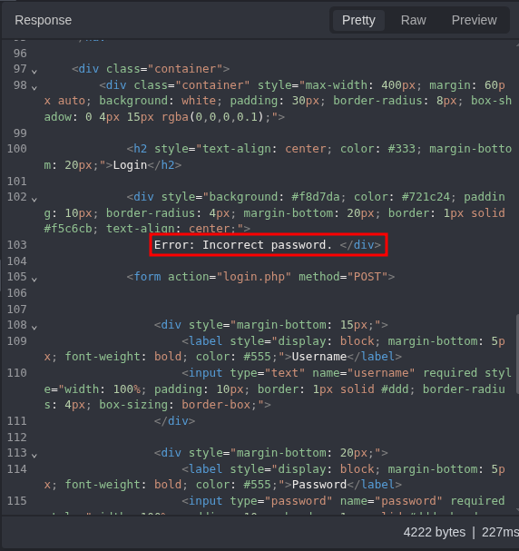 | 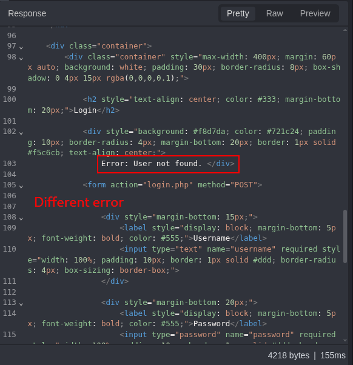 |

*Figure 7 — Cropped responses reveal whether a supplied username exists. Request cookies were omitted.*

#### Impact

An unauthenticated attacker can identify registered usernames and use the results to improve password-guessing or social-engineering attempts.

#### Remediation

Return the same generic message, status code, and similar response timing for all failed login attempts. Add rate limiting and monitoring for repeated authentication failures.

### HSL-07: Registration Accepts Weak Passwords

**Severity:** Low<br>
**Affected endpoint:** `POST /register.php`

#### Description

The registration workflow accepted a one-character password, showing that the server does not enforce a meaningful password policy.

#### Evidence

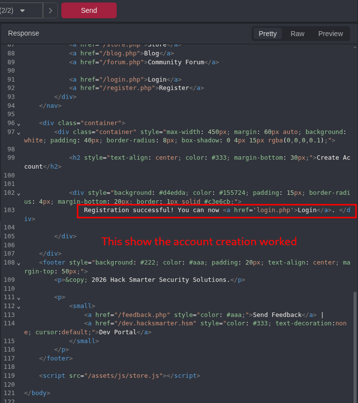

*Figure 8 — Cropped registration response confirms account creation. The submitted password was omitted.*

#### Impact

Users can select easily guessed passwords, increasing the risk of account compromise through password guessing or credential stuffing.

#### Remediation

- Require a reasonable minimum password length and permit long passphrases.
- Screen new passwords against known-compromised password lists.
- Add login throttling and offer multifactor authentication.
- Enforce the policy on the server, not only in browser-side validation.

### HSL-08: User-Controlled Post-Login Redirect

**Severity:** Low<br>
**Affected endpoint:** `POST /login.php`

#### Description

The login workflow trusts a client-controlled redirect destination. Changing the destination in the request caused the application to redirect the authenticated user to an external site after login.

#### Steps to Reproduce

1. Capture a normal login request containing the application's return location.
2. Replace the destination with an external HTTPS URL in each relevant parameter.
3. Submit valid credentials.
4. Observe navigation to the external site after authentication.

#### Evidence

- The original and modified requests were retained privately because they contain credentials and session material.
- The browser navigated to the external destination after successful authentication.


*Figure 9 — External destination loaded after the manipulated login flow.*

#### Impact

An attacker could create a trusted-looking application link that sends a victim to an attacker-controlled site after login, supporting phishing or credential theft outside the application.

#### Remediation

Use server-side identifiers for approved destinations or allow only normalized relative application paths. Do not accept arbitrary schemes, hosts, protocol-relative URLs, or encoded bypasses.

### HSL-09: Stored HTML Injection in Forum Content

**Severity:** Low<br>
**Affected function:** Community Forum posts and replies

#### Description

User-supplied HTML such as `<h1>hello</h1>` was stored and interpreted as markup. A template-expression probe (`{{ 7 * 7 }}`) was displayed literally, so the evidence does not demonstrate server-side template injection.

#### Evidence

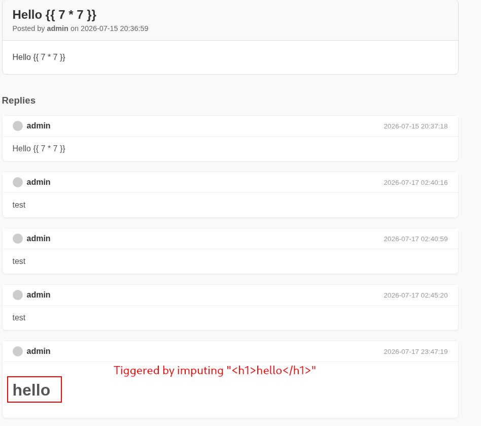

*Figure 10 — HTML renders as markup, while the template-expression probe remains literal text.*

#### Impact

An attacker can alter page appearance and inject deceptive content. Unsafe markup handling also contributes to the stored XSS issue documented separately.

#### Remediation

Encode user-generated text by default. If formatting is required, support a constrained markup format or sanitize HTML with a strict allowlist.

### HSL-10: Missing Anti-Framing Protection Permits Clickjacking

**Severity:** Low<br>
**Affected endpoint:** `GET /cart.php`

#### Description

The cart page could be embedded in an iframe on another origin, indicating missing or ineffective anti-framing controls.

#### Evidence

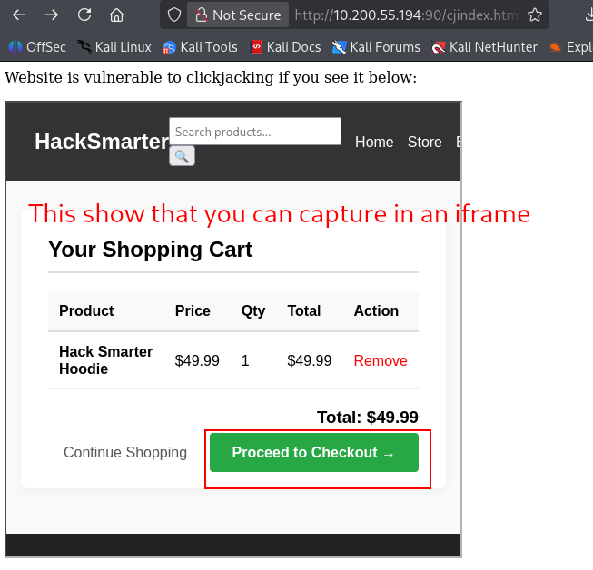

*Figure 11 — The shopping cart renders inside a page hosted on another origin.*

#### Impact

An attacker could visually overlay the framed page and attempt to trick an authenticated user into clicking application controls. The demonstrated page contained a checkout action, although successful transaction impact was not tested.

#### Remediation

Set `Content-Security-Policy: frame-ancestors 'none'` or an explicit allowlist. Retain `X-Frame-Options: DENY` or `SAMEORIGIN` for older clients where appropriate.

### HSL-11: Directory Listing Exposes Application Structure

**Severity:** Informational<br>
**Affected paths:** `/api/`, `/assets/`, `/includes/`, `/test/`, and related directories

#### Description

Several application directories return generated indexes. These pages disclose file and directory names, timestamps, application organization, and development artifacts. Examples included API subdirectories, PHP includes, and `/test/build_log.txt`. The exposed `.gitignore` also disclosed repository conventions.

#### Evidence

| API index | Includes index |
|---|---|
| 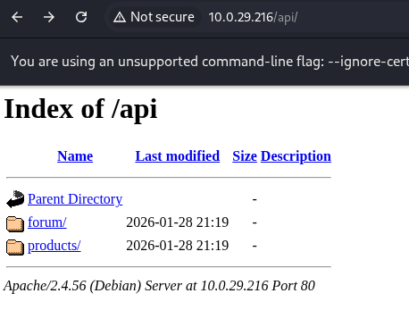 | 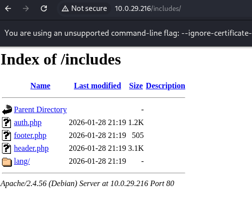 |

| Test artifacts | Repository metadata |
|---|---|
| 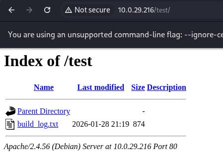 | 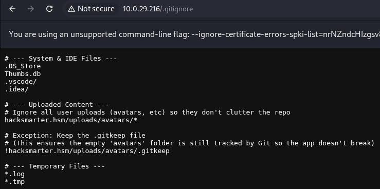 |

*Figure 12 — Directory indexes and development artifacts exposed by the web server.*

#### Impact

The disclosures improve attack-surface mapping and may reveal forgotten endpoints or development artifacts. No secret was confirmed in the listed directory pages.

#### Remediation

- Disable automatic directory indexing.
- Remove test artifacts and development files from deployed web roots.
- Deny direct web access to include and configuration directories.
- Review exposed files for secrets and rotate any discovered credentials.

## Additional Observations

- `/admin/` and `/admin/index.php` redirected unauthenticated users to the login page.
- `/server-status` existed but returned HTTP 403, which is the expected access-control outcome.
- `/config/` and `/uploads/` were discovered, but the supplied screenshots showed timeouts rather than confirmed directory contents.
- The development dashboard contained links whose disabled styling could be removed locally in browser developer tools. Changing client-side presentation is not a security issue by itself; authorization must be assessed through server responses.
- Identical PHP session identifiers were written in the notes for several accounts, but the supplied evidence did not establish a controlled multi-session comparison. Session fixation or cross-account session reuse should be retested before reporting.
- SSRF and CORS were listed in the notes without supporting proof and are therefore not reported as confirmed findings.

## Remediation Priorities

1. Prevent script execution from uploads and relocate uploaded content outside the web root.
2. Replace dynamic file inclusion with a fixed language allowlist.
3. Enforce server-side object authorization on every account-management request.
4. Encode or sanitize all forum content and deploy a restrictive Content Security Policy.
5. Remove diagnostic and development artifacts, update unsupported software, and disable directory listing.
6. Harden authentication with generic errors, stronger password controls, throttling, secure cookies, and reauthentication for sensitive changes.

## Evidence Handling

The GitHub-ready evidence set intentionally omits screenshots containing plaintext passwords, session cookies, or unnecessary raw course material. Credentials and session identifiers from the working notes must not be published and should be treated as compromised if reused anywhere outside this isolated lab.
